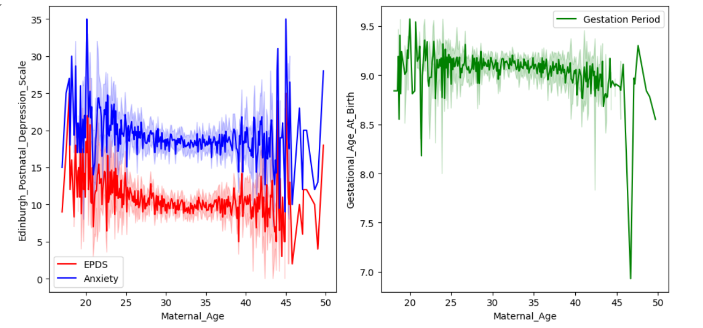
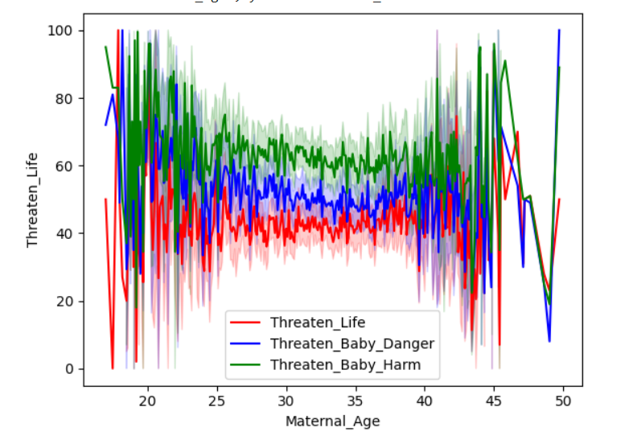
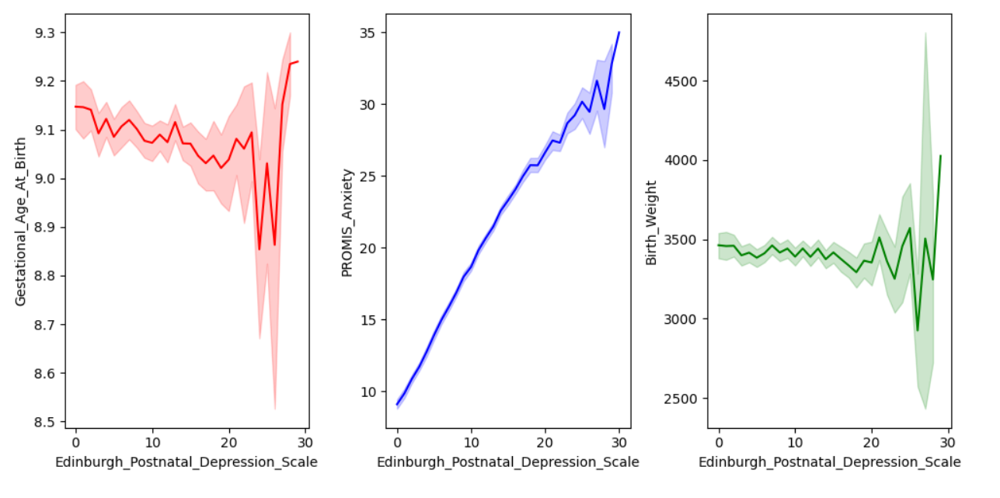
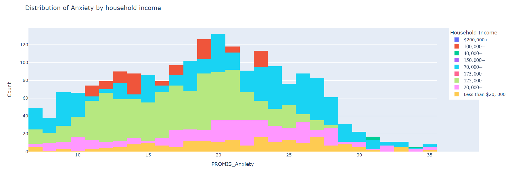
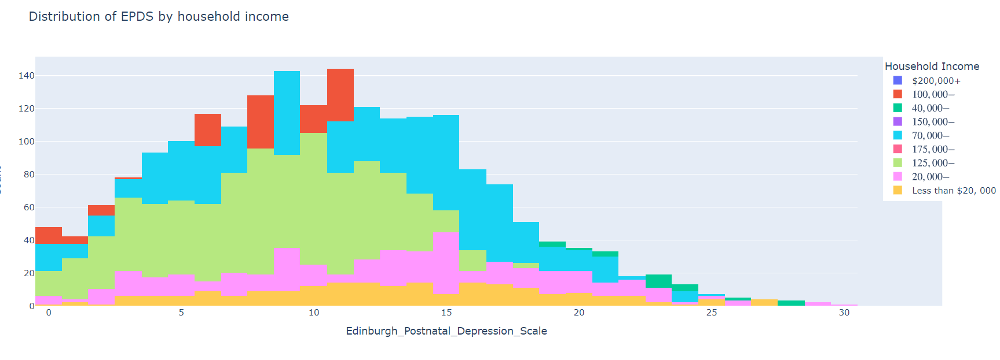

# Impact-of-Covid-on-Mental-Health-during-Pregnancy
This project is all about finding insights and the effect of the covid on the mental health of women during pregnancy. This analysis considers many factors like maternal age, household income and education to study the depression, anxiety and health of the baby. It groups women according to age and household income and finds how differently they are affected by depression and anxiety. It also studies the effect of depression
and anxiety on baby's health in terms of baby's height and weight.

## Data Source
- Mental Health in Pregnancy During Covid- 19.csv

## Findings
- If a lady is in the age group 25-38 while conceiving she will not be under any anxiety attacks, moreover, she will also not suffer from any post-pregnancy depression and can take care of herself and her baby more effectively.

- If a female is conceiving beyond the age of 42, this is very risky for the baby as there are very high chances of pre-mature birth of the baby and the pre-mature birth may be in less than 7.5 months of gestation periods.
  

- Females falling in the age group of 25-42 are less worried about the impact of covid-19 on them and their new born health. They are less worried as compared to females who conceived less than 25 and females who conceived after the age of 45. its also evident that females after the age of 43, are more worried about the impact of covid-19 on their babies. It may be due to high anxiety and post-pregnency depression in this age group
  
- After the age of 38, there is a notable 13%[28-41%] increase in the likelihood of women requiring a c-section rather than opting for a natural delivery. this statistic underscores the physiological changes associated with maternal age and their implications for childbirth.

- On testing the relationship between maternal age and [ will the new born need intensive medical supervision after birth , healthy or unhealthy weight, healthy or unhealthy height] ,by hypothesis testing , it was found that there is a significant association between the age of pregnant women and the likelihood of NICU_Stay and babe having unhealthy weight, however there is no evidence for significant association between age and height of new born.

- High anxiety , depression , premature birth can be reason for admission of babe to NICU after delivery.
- Observational data indicates a significant correlation between high EPDS scores and the likelihood of pre-mature births. However, it's important to note that these pre-mature births generally occur after 8.5 months of gestation, which falls within the medically accepted range and thus, poses minimal health risks to the newborn.

- Women experiencing high levels of EPDS or anxiety are likely to experience the other condition at similar intensity levels. This linear association suggests that an increase in one condition directly correlates with an increase in the other, highlighting the intertwined nature of these mental health challenges.
 
- There is 6.2% more chances of baby being unhealthy when going to c-section delivery compared to vaginally delivery.
- 
- A particularly alarming statistic is that babies with unhealthy birth weight have a 22% chance of requiring a NICU stay, which is 15% higher than for babies with healthy birth weight. This same trend is evident with birth height, underscoring the critical importance of healthy birth metrics in reducing the need for intensive neonatal care.
- 
- The most vulnerable group to high scores on the Edinburgh Postnatal Depression Scale (EPDS) consists of women of all age groups with low household income and low education levels. However, there are notable instances where women from high-income and highly educated backgrounds are also susceptible to high EPDS scores. This vulnerability predominantly affects women aged 40 and above, suggesting that advanced maternal age can be a significant risk factor for depression during pregnancy and postpartum.

- There is a 14% likelihood that women with low EPDS (depression) scores will experience high anxiety. Conversely, women with high EPDS scores have an 81% chance of also experiencing high anxiety, particularly exacerbated by the stress and uncertainties brought on by the COVID-19 pandemic. This strong correlation underscores the compounded mental health challenges faced by this group during such crises.

- Families with low income, regardless of age and education levels, exhibit heightened concerns about the health and safety of the mother and newborn due to COVID-19. This widespread anxiety reflects the profound impact of socioeconomic status on perceived vulnerability and health security during the pandemic

- Individuals with a master’s degree but low income, and those with high income but lower education levels, share similar levels of concern about the impact of COVID-19 on the mother and newborn. This finding highlights that both education and income are equally significant factors in determining the level of worry and perceived risk related to the pandemic's effects on maternal and infant health.

